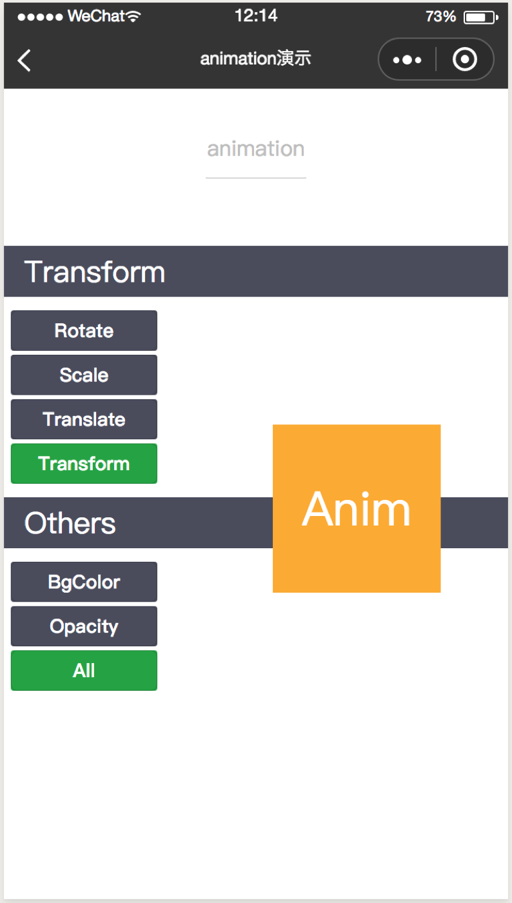

# c-animation

------

动画组件

### 属性

<table>
  <tr>
    <th>属性名</th>
    <th>类型</th>
    <th>必填</th>
    <th>说明</th>
  </tr>
  <tr>
    <td>animation</td>
    <td>Object</td>
    <td>是</td>
    <td>要执行的动画效果，由cml.createAnimation创建才会生效</td>
  </tr>
</table>

### 示例

```html
<template>
  <c-animation animation="{{animationData}}">
      <text>hello world</text>
  </c-animation>
</template>
<script>
import { provins } from "./data";
export default {
  data: {
    animationData: {}
  },
  mouted() {
    const animation = cml.createAnimation();
	this.animationData = animation.opacity(0).export();
  }
};
</script>
```

<div style="display: flex;flex-direction: row;justify-content: space-around; align-items: flex-end;">
  <div style="display: flex;flex-direction: column;align-items: center;">
    
    <text style="color: #fda775;font-size: 24px;">wx</text>
  </div>
  <div style="display: flex;flex-direction: column;align-items: center;">
    
    <text style="color: #fda775;font-size: 24px;">web</text>
  </div>
  <div style="display: flex;flex-direction: column;align-items: center;">
    
    <text style="color: #fda775;font-size: 24px;">native</text>
  </div>
</div>

[查看完整示例](/example/c-animation.md)