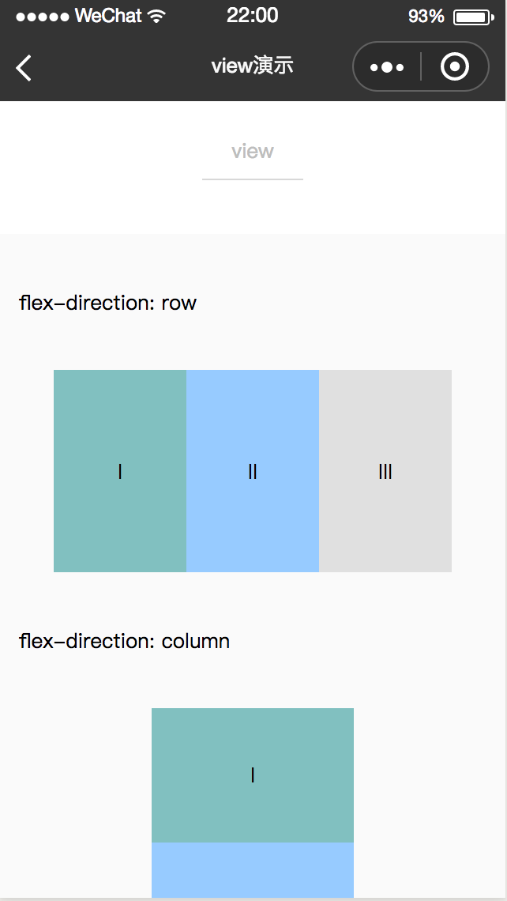

# view
-------
视图容器

`<view>` 是 chameleon 内置的组件，类似web端的div块级元素标签。

### 示例
```html
<template>
  <view class="page-demo">
    <view class="page-box">
      <view class="page-section">
        <view class="page-section-title">flex-direction: row</view>
        <view class="page-section-content" style="flex-direction: row">
          <view class="flex-item demo-1"><text>I</text></view>
          <view class="flex-item demo-2"><text>II</text></view>
          <view class="flex-item demo-3"><text>III</text></view>
        </view>
      </view>
      <view class="page-section">
        <view class="page-section-title">flex-direction: column</view>
        <view class="page-section-content" style="flex-direction: column">
          <view class="flex-item-V demo-1"><text>I</text></view>
          <view class="flex-item-V demo-2"><text>II</text></view>
          <view class="flex-item-V demo-3"><text>III</text></view>
        </view>
      </view>
    </view>
  </view>
</template>
<style scoped>
 .page-demo {
   background: #FAFAFA;
   position: absolute;
   top: 0px;
   bottom: 0px;
   left: 0px;
   right: 0px;
 }
.page-box {
  margin-top: 80px;
}
.page-section-title {
  font-size: 32px;
  margin: 0 30px;
}
.page-section-content {
  margin: 80px;
  display: flex;
  font-size: 32px;
  text-align: center;
  justify-content: center;
  align-items: center;
}
.flex-item {
  width: 200px;
  height: 300px;
  line-height: 300px;
  justify-content: center;
  align-items: center;
}
.flex-item-V {
  width: 300px;
  height: 200px;
  line-height: 200px;
  justify-content: center;
  align-items: center;
}
.demo-1 {
  background-color: #81c0c0;
}
.demo-2 {
  background-color: #97cbff;
}
.demo-3 {
  background-color: #e0e0e0;
}
</style>

```



### Bug & Tip
tip: 如果需要使用滚动视图，请使用 [scroller](/component/base/view/scroller.md) 包裹


