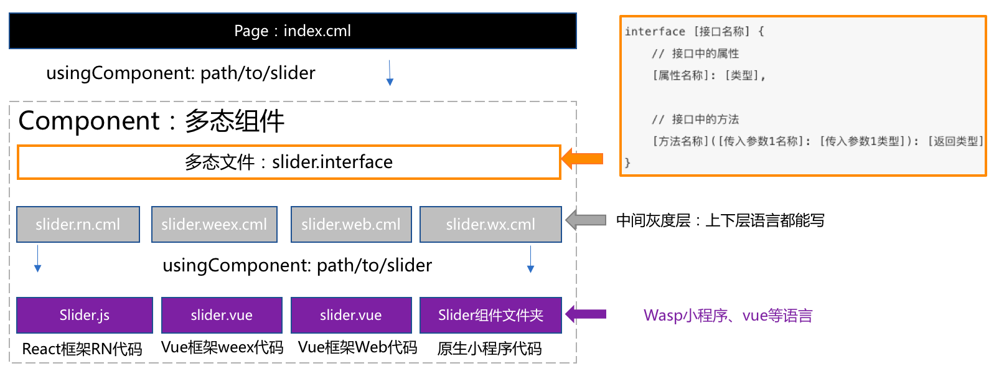

## 组件多态
chameleon在跨端的统一性上做了很多的工作，但即使是做到了99%的统一，仍然存在着1%的差异，基于代码可维护性的考量，chameleon引入了[多态协议](../intro.md)。




#### 组件多态的使用
项目根目录下执行`cml init component`，选择`多态组件`，输入组件名称，例如`c-list`，生成如下文件结构

```
├── components
│   ├── c-list   
│   │   ├── c-list.interface                           
│   │   ├── c-list.web.cml                          
│   │   ├── c-list.weex.cml                        
│   │   ├── c-list.wx.cml 
│   │   └── ...
```
`c-list.web.cml`、`c-list.weex.cml`、`c-list.wx.cml`、`...` 分别是各端的实现，在各端的cml文件中还可以引用各端原生的组件。因为组件的查找优先级如下：

- 查找`cml`文件，例如`/components/c-list/c-list.cml`.
- 查找各端的cml文件，例如`/components/c-list/c-list.web.cml`
- 查找各端原生代码组件：
- 规则如下：
  - web和weex端查找vue文件，例如`/components/c-list/c-list.vue`
  - 微信小程序端查找wxml文件，例如`/components/c-list/c-list.wxml`
  - 支付宝小程序端查找axml文件，例如`/components/c-list/c-list.axml`
  - 百度小程序端查找swan文件，例如`/components/c-list/c-list.swan`


#### 接口校验

`.interface`文件利用[接口校验语法](/framework/polymorphism/check.md)对组件的属性和事件进行类型定义，保证各端的组件和事件一致，框架在开发环境的运行时做校验。例如`c-list.interface `

```javascript
type eventType = 'change';
type eventDetail = {
  value: string
}
type changeEvent = (a: eventType, detail: eventDetail) => void;

export default Interface Clist {
  name: string,
  age: number,
  changeEvent: changeEvent
}
```

#### 什么时候用到组件多态？
chameleon中的组件是采用单文件格式的cml文件，其中包括了一个组件所拥有的视图层、逻辑层及配置信息。考虑以下两种场景：
- 场景一：当某个功能组件需要调用各端的原生组件，各端原生组件的属性不一致，或者一端有原生组件，其他端需要组合实现等。
- 场景二：产品在需求上导致某一个组件在各端的结构表现不同。

#### 为什么要引入多态协议
以场景一为例，先看一个最容易理解的跨端组件实现：
```html
<template c-if="{{ENV === 'web'}}">
  <ul c-for="{{list}}">
    <li>{{item.name}}</li>
  </ul>
</template>
<template c-else-if="{{ENV === 'wx'}}">
  //假设wx-list  是微信小程序原生的组件
  <wx-list data="{{list}}"></wx-list>
</template>
<template c-else-if="{{ENV === 'weex'}}">
  //假设list  是weex端原生的组件
  <list source="{{list}}"></list>
</template>
```

上面的代码块是一个简单的列表实现，wx和weex都是使用了各自的原生组件，这样的实现方法其实是把三端或者N端的模版放在了同一个文件中，当然，这里只是展示了模版的复杂，假设在js代码块中也存在着端的判断，那代码的复杂可想而知。

总结下来，这样的代码有如下待解决问题：
1. 增加代码复杂度，难以维护
2. 各端组件的属性和事件定义可能不一致
3. 各端组件耦合在一起，bug风险极高
4. 没有做到各端代码的分离，增大体积

而利用了组件多态之后的使用方式如下：
```html
<c-list data="{{list}}"><c-list>
```
可以看到我们只引用了一个`c-list`组件，该组件提供了统一的属性。

#### 场景举例

todo


